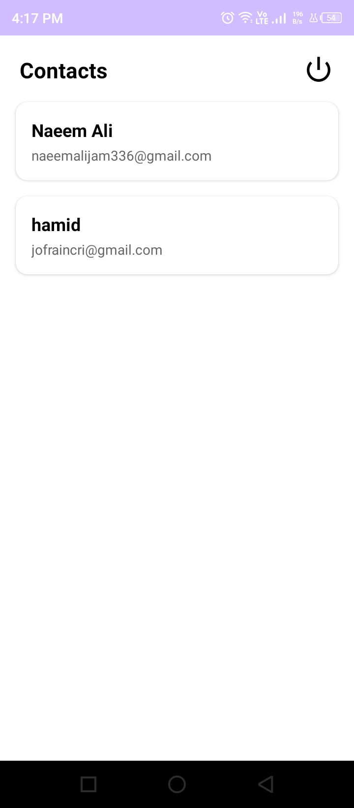
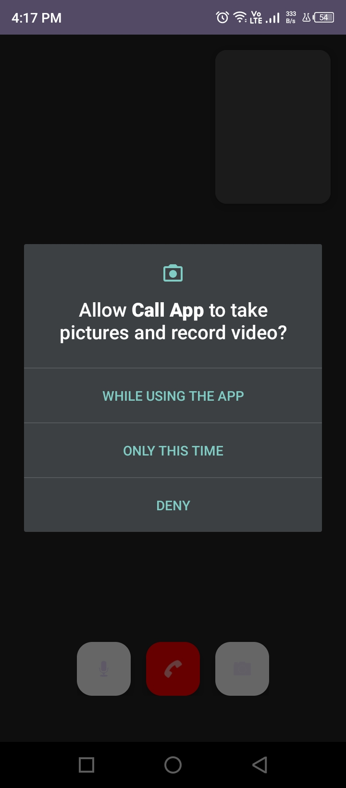

# CallApp – Android Video Calling Application

CallApp is a simple Android video calling application built using **Java** and **Android Studio**.  
The app uses **Firebase** for authentication and backend services, while **Agora Video SDK** handles real-time video communication.

The project follows the **MVVM architecture pattern** to keep the code clean, organized, and maintainable.

---

# Features

- User Registration & Login
- Real-Time Video Calling
- Registered Users List
- Incoming Call Detection
- Call Request Management
- MVVM Architecture
- Firebase Integration
- LiveData & ViewModel Support
- Data Binding Implementation

---

# Application Flow

## 1. User Authentication
Users can create an account or log in using Firebase Authentication.  
Basic user information such as name and email is stored in Firebase Firestore.

## 2. Users List
After login, the app displays all registered users available on the platform.

## 3. Call Request
When a user selects a contact, the app generates a unique channel name and sends a call request through Firestore.

## 4. Incoming Call Detection
The application continuously listens for incoming call requests in real time.

## 5. Video Calling
Once the call is accepted, both users join the same Agora channel and start a real-time video call.

---

# Technologies Used

- **Java**
- **Android Studio**
- **Firebase Authentication**
- **Firebase Firestore**
- **Agora Video SDK (v4.x)**
- **MVVM Architecture**
- **LiveData**
- **ViewModel**
- **Data Binding**

---

# Setup Instructions

## Firebase Setup

1. Create a new project in Firebase Console
2. Add your Android application
3. Download the `google-services.json` file
4. Place the file inside the `app/` directory

---

## Firestore Setup

Create the following collections:

- `users`
- `calls`

For testing purposes, Firestore rules can temporarily allow read/write access.

---

## Agora Setup

1. Create an account on Agora.io
2. Generate an Agora App ID
3. Replace the existing App ID inside `VideoCallActivity`

---

## Required Permissions

The application requires:

- Camera Permission
- Microphone Permission
- Internet Permission

---

# Project Structure

## `CallRepository.java`

Handles Firebase operations including:

- User data management
- Call requests
- Call status updates

---

## `AuthViewModel`

Manages authentication-related logic between the UI and Firebase.

---

## `CallViewModel`

Handles video call operations and communication between the UI and repository.

---

## `CallAdapter`

Manages the users list and handles call actions.

---

# Architecture

The application is built using the **MVVM (Model-View-ViewModel)** architecture to separate business logic from the UI layer.

This structure improves:
- Code readability
- Maintainability
- Scalability

---

# Future Improvements

The project can be extended further with additional features such as:

- Push Notifications using Firebase Cloud Messaging (FCM)
- Group Video Calling
- In-App Messaging System
- Call History
- Profile Pictures using Firebase Storage
- Online/Offline User Status
- End-to-End Encryption
- Improved UI/UX
- Additional Call Controls

---
# Screenshots
| 1. User Directory (`contact-list.jpeg`) | 2. Runtime Permissions (`permission.jpeg`) | 3. Active Video Call (`call.jpg`) |
| :---: | :---: | :---: |
|  |  |  |
